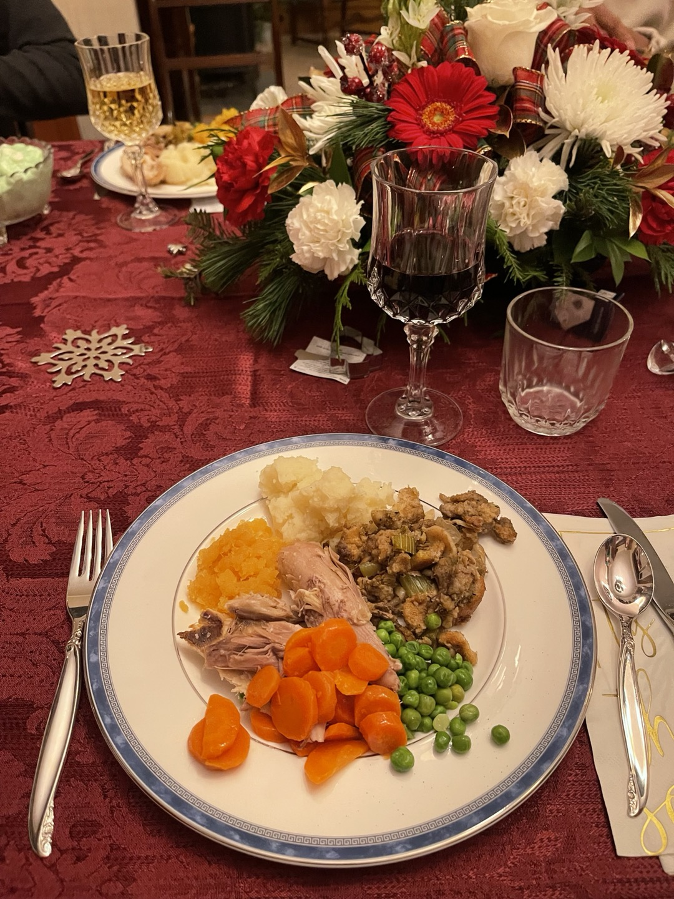
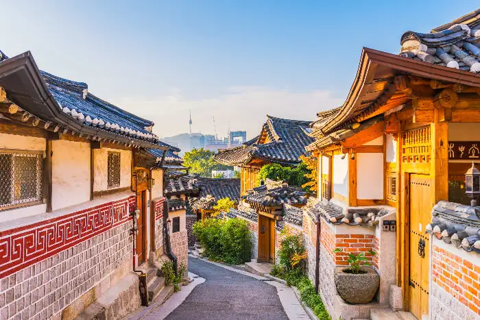

# Chan_WLS_HW1
 
HW1
This is the repo for the hw1
## Wing Lam Stephanie Chan & Park Kyuri
Wing Lam Stephanie Chan
## Hobbies
1.  Podcast – I am podcaster. I have a channel call Tearoom podcast.
2.  Ceramic – I like to do pottery, make some cups or bowls
 
3.  Photography – I like taking animal photo and landscape photo
 
## Favourite movie
1.  **Harry Potter**
2.  **A Guilty Conscience**

## Culture
I am from Hong Kong, my favourite place in Hong Kong is the Victoria Habour.
 
## Favourite dishes
My favourite dishes is sushi.

## Skills:
Singing

Doing Podcast
[Tearoom Podcast](https://open.firstory.me/user/tearoompodcast)

# Park_Kyuri_HW1
HW1
This is the repo for the hw1
## Wing Lam Stephanie Chan & Park Kyuri
Park Kyuri
## hobbies
1. Fine art - I love oil painting. Painting makes me feel alive.

2. Cooking - I enjoy cooking. One of the greatest joys in my life is cooking for the people I love.

## Favourite Movies
1. Interstella
2. Incendies
## Culture & Background
I am from Seoul, South Korea. Seoul is full of fun! I promise you will like being here.

## Favourite Food
My favourite dish is Pizza
## Skills
Playing piano
Playing video games
